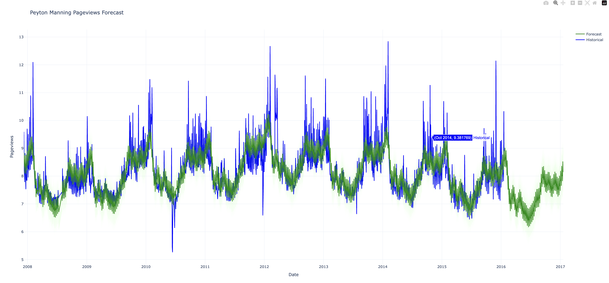

# Peyton Manning Forecast with Prophet and InfluxDB 3 Core

This project uses **InfluxDB 3 Core's Processing Engine** and **FB Prophet** to forecast pageviews of the Wikipedia article for Peyton Manning.

It consists of two plugins:

1. **[load_peyton_data.py](load_peyton_data.py)** – Fetches historical data and writes it to InfluxDB  
2. **[forecast_peyton.py](forecast_peyton.py)** – Trains a Prophet model and writes the forecast back to InfluxDB
3. **[plot_forecast_http.py](plot_forecast_http.py)** - Displays a graph of the historical data and forecast

---

## 🧩 Plugins Overview

### 1️⃣ `load_peyton_data.py`

- HTTP-triggered plugin  
- Downloads a public CSV of daily Wikipedia views  
- Writes rows to the `peyton_views` table in InfluxDB  

Trigger this manually via `curl` or any HTTP request.

### 2️⃣ `forecast_peyton.py`

- Scheduled plugin (runs daily or on your schedule)  
- Reads data from `peyton_views`  
- Fits a Prophet model  
- Forecasts 365 days into the future  
- Writes summary forecast results to `prophet_forecast`  

### 3️⃣ `plot_forecast_http.py`
- HTTP-triggered plugin  
- Reads data from both `peyton_views` and `prophet_forecast`  
- Creates an interactive Plotly chart combining historical data and forecast  
- Returns the chart as HTML for browser viewing

---

## ⚙️ Setup Instructions

### ✅ Step 1: Install Required Packages

This project depends on `plotly` and `prophet`. Install them using:
```bash 
influxdb3 install package plotly
```
```bash
influxdb3 install package prophet
```
Create a database:
```bash
influxdb3 create database prophet
```
### ✅ Step 2: Save the Plugins
Place both plugins in your configured --plugin-dir:
- load_peyton_data.py
- forecast_peyton.py
- plot_forecast_http.py
  
### ✅ Step 3: Create Triggers
#### Plugin 1: Load Data via HTTP
```bash
influxdb3 create trigger \
  --trigger-spec "request:load_peyton" \
  --plugin-filename "load_peyton_data.py" \
  --database prophet \
  load_peyton
```
Then trigger it manually:

```bash
curl http://localhost:8181/api/v3/engine/load_peyton
```
You should see the following output:
```bash
{"status": "success", "rows_written": 2905}
```
#### Plugin 2: Forecast on a Schedule
```bash
influxdb3 create trigger \
  --trigger-spec "every:1d" \
  --plugin-filename "forecast_peyton.py" \
  --database prophet \
  peyton_forecast
```
To disable the forecasting:
```bash
inflxudb3 disable trigger --databse prophet peyton_forecast
```

#### Plugin 3: Visualize Forecast via HTTP
```bash 
influxdb3 create trigger \
  --trigger-spec "request:plot_forecast" \
  --plugin-filename "plot_forecast_http.py" \
  --database prophet \
  forecast_plot
```
---
## 📊 Output

### Tables

- **`peyton_views`**: Raw historical pageview data  
- **`prophet_forecast`**: All forecasts made by prophet

### Graph 
View in your browser:
```
http://localhost:8181/api/v3/engine/plot_forecast
```


---

## 🧠 How It Works

- **Prophet** is a time series forecasting library from Facebook that supports trends, seasonality, and uncertainty modeling.  
- **InfluxDB’s Processing Engine** allows you to embed Python directly inside the database.  
- You can build similar plugins to forecast your own metrics, user traffic, sales data, or anything time-based!
